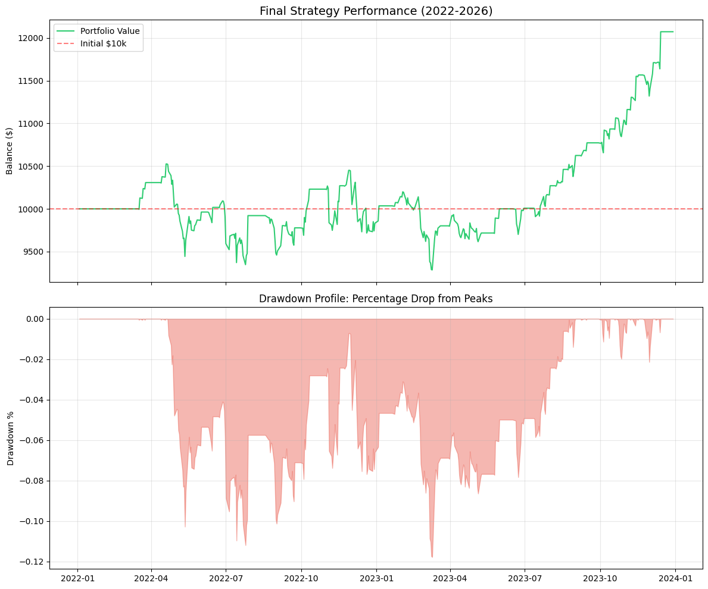

# Metal-Divergence-Analysis
Gold-Silver Ratio Mean-Reversion Strategy
Project Overview
This repository contains a systematic backtesting framework for a mean-reversion strategy based on the Gold-Silver Ratio (GSR). The study covers the period from 2022 through early 2026, encompassing a variety of market regimes including high-inflationary environments and significant precious metals volatility. The project demonstrates the full quantitative research lifecycle: data ingestion, cleaning, signal generation, and risk-adjusted performance evaluation.

Methodology
The strategy operates on the principle that the relative price of Gold to Silver tends to revert to a moving average over time.

Signal Generation
The core logic utilizes a rolling Z-Score calculation to identify overextended price relationships:

Rolling Window: A 50-day simple moving average (SMA) and standard deviation are calculated for the GSR.

Z-Score Formula: The distance of the current ratio from the mean is measured in units of standard deviation.

Entry Logic:

Short Gold / Long Silver: Executed when the Z-Score exceeds +1.0, indicating Gold is historically expensive relative to Silver.

Long Gold / Short Silver: Executed when the Z-Score falls below -1.0, indicating Gold is historically undervalued relative to Silver.

Execution and Friction
To maintain institutional realism, the backtest incorporates:

Lagged Execution: Signals generated at the close of Day T are executed at the open of Day T+1 to eliminate look-ahead bias.

Transaction Costs: A fixed cost of 5 basis points (0.05%) is applied to the total notional value of every position change to account for broker commissions and bid-ask spreads.

Data Integrity and Anomaly Detection
A significant portion of this research involved the diagnosis and resolution of data quality issues. Initial backtests yielded non-physical results due to anomalies in the raw price feeds.

Outlier Remediation
During the 2022 data period, certain price feeds recorded Gold at extreme discount values (e.g., $4.45 USD vs market rates of ~$1,800 USD). This created artificial spikes in the GSR, leading to mathematically impossible Sharpe Ratios.

Cleaning Pipeline: Implemented a filtering layer that validated asset prices against historical bounds and removed duplicate timestamps.

Normalization: Standardized all return calculations to decimal precision to ensure statistical metrics remained accurate across concatenated datasets.

Performance Analysis
After adjusting for transaction costs and scrubbing the data, the strategy produced the following risk-adjusted metrics:

Net Sharpe Ratio: 0.53

Maximum Drawdown: -11.78%

95% Daily Value at Risk (VaR): -1.11%

Final Portfolio Value: $12,072.56

Initial Capital: $10,000.00

The results indicate that while the strategy experienced periods of stagnation and a maximum peak-to-trough decline of 11.78%, it maintained a positive expectancy and a stable risk profile. The 95% Daily VaR suggests that daily losses remained within a controlled threshold of 1.11% of the total portfolio value.

Project Structure
scripts/: Contains modularized Python code for the backtesting engine and performance analytics.

notebooks/: Detailed exploratory data analysis and visualization of the equity curve.

requirements.txt: List of dependencies required to reproduce the environment.

